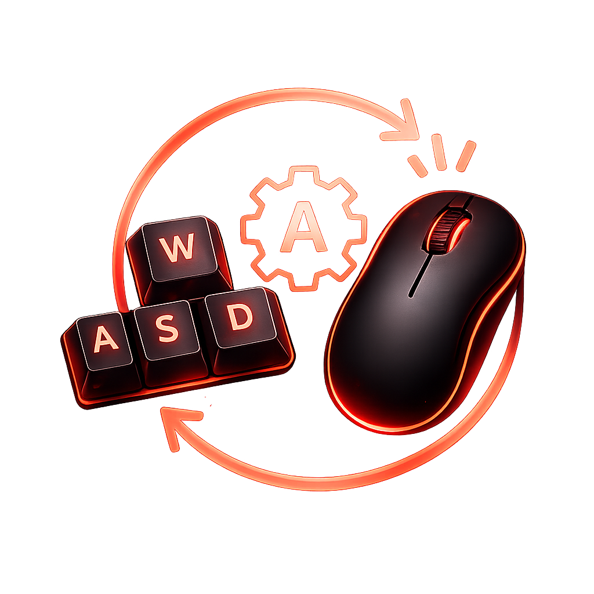

# CachyOS / Wayland Native Key Clicker & Holder

A native C++ Qt6 auto-clicker and key-holder utility designed specifically to bypass security restrictions on modern Wayland sessions (like CachyOS, Arch, or Fedora) using the Linux kernel `uinput` architecture.



## Features
- **Wayland Compatible**: Bypasses display server boundaries by creating a hardware-level virtual input device.
- **Global Toggle**: Uses raw `/dev/input` polling to handle an `F6` start/stop hotkey globally (even when minimized or in-game).
- **Dual Mode Execution**: Supports repetitive firing (Autoclick) or sustained pressure (Hold).
- **Responsive UI**: Custom lockable millisecond input frequency widget with active visual glowing states.
- **Standalone Binary**: Zero external runtime scripting dependencies. Baked-in interface assets.

## Prerequisites
On CachyOS / Arch Linux, install the compilation toolchain and Qt6 libraries:
```bash
sudo pacman -S base-devel cmake qt6-base